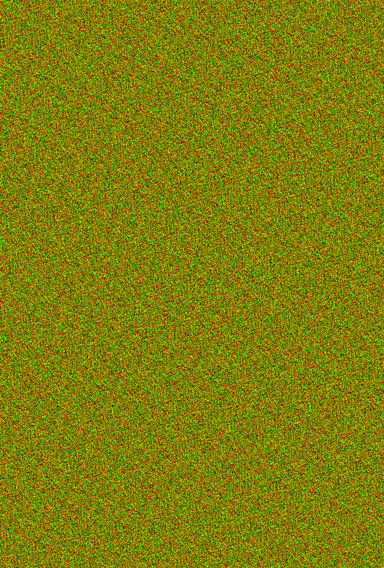
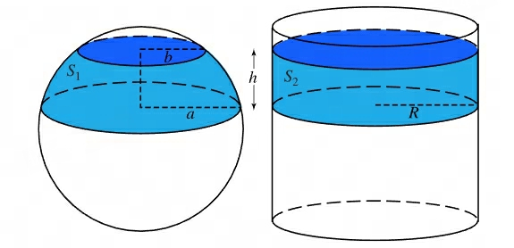
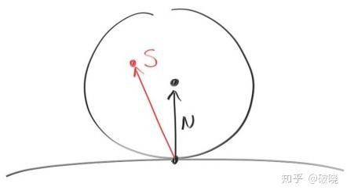
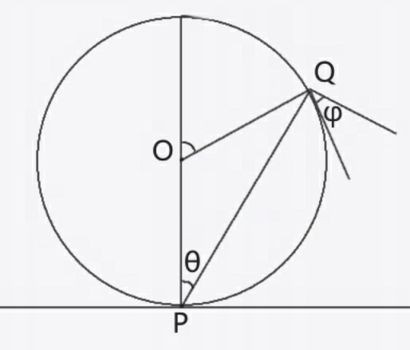
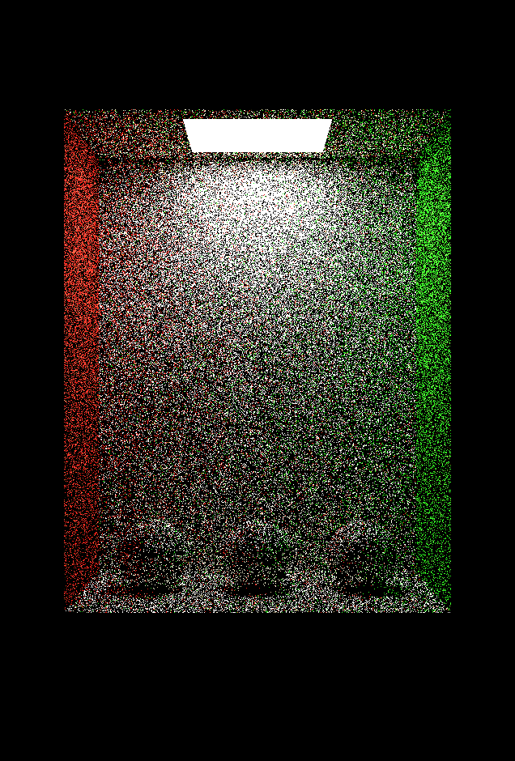
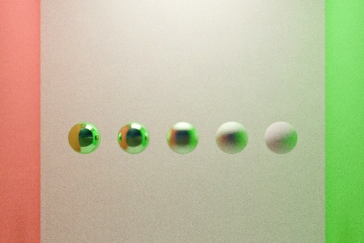
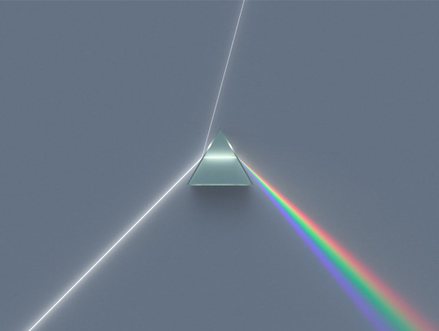
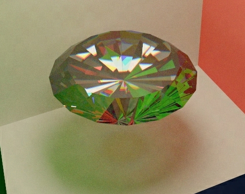

# 前言和准备工作

现在实际工作中很多东西都不太方便作为知乎专栏发布，虽然也都是些拾人牙慧的垃圾。

在ShaderToys上闲逛的时候发现了这个[Demofox Path Tracing 1](https://www.shadertoy.com/view/tsBBWW)，看了下附带的博客，突然发现我七年前也写过类似的玩意儿，但是就写到一半太监了。

于是我准备拾掇拾掇一下重新出发，同时也是尽可能把原先知其然而不知其所以然的地方查阅一次。

本文整体的流程参考了《Casual Shadertoy Path Tracing》和《Ray Tracing in One Weekend》，不打算看我废话的可以直接移步：

> [Casual Shadertoy Path Tracing 1: Basic Camera, Diffuse, Emissive](https://blog.demofox.org/2020/05/25/casual-shadertoy-path-tracing-1-basic-camera-diffuse-emissive/)
> [Casual Shadertoy Path Tracing 2: Image Improvement and Glossy Reflections](https://blog.demofox.org/2020/06/06/casual-shadertoy-path-tracing-2-image-improvement-and-glossy-reflections/)
> [Casual Shadertoy Path Tracing 3: Fresnel, Rough Refraction & Absorption, Orbit Camera](https://blog.demofox.org/2020/06/14/casual-shadertoy-path-tracing-3-fresnel-rough-refraction-absorption-orbit-camera/)
> 原版《Ray Tracing in One Weekend》：https://raytracing.github.io/

本工程使用VS Code的[Shader Toy](https://marketplace.visualstudio.com/items?itemName=stevensona.shader-toy)插件进行，一共五章，均可在这里下方找到每一阶段的工程示例（其实就是先写完一阶段再赶的文章嘻嘻嘻）

# 场景搭建

在开始一切的一切之前，先声明好射线和命中的结构体。

```glsl
// 射线
struct ray {
    vec3 start; // 起点
    vec3 dir;   // 方向，已归一化
};

// 射线与物体相交信息
struct hitInfo {
    float t;      // 距离
    vec3 pos;     // 交点位置
    vec3 normal;  // 法线
};
```

因为还没有涉及到具体的光照计算，所以此处先不考虑光照成分。

## 从 UV 到相机和射线

```glsl
    vec2 uv = fragCoord/iResolution.xy;
    uv.y = 1.0f - uv.y; // 翻转Y轴坐标，由于OpenGL的纹理坐标原点在左下角，我更习惯以左上角为原点
    float aspect = iResolution.x / iResolution.y;
    float fovScale = tan(radians(FOV * 0.5f));
    vec3 rayDir = normalize(vec3((uv.x - 0.5f) * 2.0f * aspect * fovScale, (0.5f - uv.y) * 2.0f * fovScale, -1.0f));
    ray r;
    r.start = vec3(0.0f, 5.0f, 30.0f); // 相机位置
    r.dir = rayDir;
```

在ShaderToys中，输入的是当前像素的坐标。

首先，我们需要将像素坐标 `fragCoord` 归一化为 [0,1]范围内的 `uv` 坐标。

随后翻转Y轴，正常人更加习惯Y轴正方向朝上的做法。

为了模拟真实相机的成像过程，我们需要根据视场角（FOV）和屏幕宽高比（Aspect Ratio）生成从相机出发穿过该像素的射线（Ray），整个过程类似下图：


在这里，相机被固定在 `(0, 5, 30)`，并垂直看向 Z 轴负方向。通过调整 `fovScale`，我们可以控制视角的大小，就像在现实中更换不同焦距的镜头一样。

## 计算射线与球相交

说实在的，突然要解释下球和射线相交，内心还有点犯怵——我踏马就记得个 $b^2-4ac$ 判别式了——幸好我当年还留了记录（笑


假设一条射线为 $\bold O+t\bold D$，有一半径为 $R$ 的球体圆心为 $\bold C$，球上任意一点为 $\bold p$。如果射线与球只有一个交点，也就是使射线与球相切于 $\bold p$时，有：
$$
\bold p = \bold O+t\bold D \\
(\bold O+t\bold D-\bold C)\cdot(\bold O+t\bold D-\bold C)=R^2
$$
展开后有：
$$
t^2(\bold D \cdot \bold D)+2t(\bold D\cdot(\bold O-\bold C))+(\bold O-\bold C)\cdot(\bold O-\bold C)-R^2=0
$$
此为二元一次方程，使用判别式即可确定是否相交，通过求根公式即可得出 $t$ 进而得到射线与球的交点：

```
bool TestHitSphere(ray r, vec3 center, float radius, inout hitInfo hit) {
    vec3 oc = r.start - center;
    float a = dot(r.dir, r.dir);
    float b = 2.0f * dot(oc, r.dir);
    float c = dot(oc, oc) - radius * radius;
    float discriminant = b * b - 4.0f * a * c;
    if (discriminant < 0.0f) {
        return false;
    } else {
        float t = (-b - sqrt(discriminant)) / (2.0f * a);
        if (t > MIN_DIST && t < MAX_DIST) {
            hit.t = t;
            hit.pos = r.start + t * r.dir;
            hit.normal = normalize(hit.pos - center);
            return true;
        }
    }
    return false;
}
```

## 计算射线与面相交

计算射线与面相交，准确的说是与矩形相交的问题，可以转化为求射线与组成该矩形的两个三角形相交的问题，解决后者用到的是**Möller-Trumbore** 算法。

如果撸过软渲染器会感觉很熟悉，怎么表示三角形？
$$
\bold P(u,v)=(1-u-v)\bold V_0+u\bold V_1+v\bold V_2\\
u,v \geq 0\\
u+v \leq 1
$$
诶，是不是跟那个三角形重心坐标插值一模一样。同样，若射线与三角形相交，必存在一点，使：
$$
\bold O+t\bold D=(1-u-v)\bold V_0+u\bold V_1+v\bold V_2
$$
此处有三个未知量，但是不慌，先写成：

$$
\bold O+t\bold D=\bold V_0+u(\bold V_1-\bold V_0)+v(\bold V_2-\bold V_0)
$$
定义两条边向量及起点到顶点的向量：
$$
\bold E_1=\bold V_1-\bold V_0\\
\bold E_2 = \bold V_2-\bold V_0\\
\bold S = \bold O-\bold V_0
$$
则有：
$$
-t\bold D+u\bold E_1+v\bold E_2=\bold S\\
\left[
\begin{array}{l}
-\bold D & \bold E_1 & \bold E_2
\end{array}
\right]
\left[
\begin{array}{l}
t\\
u\\
v
\end{array}
\right]
=\bold S
$$
这里就得到了一个典型的$\bold A x=\bold B$的线性方程组，其中$\bold A$是一个3x3的方块矩阵。

在此插入克莱姆法则的介绍：

> 若$\bold A$是一个可逆矩阵（$det(\bold A)\neq0$），那么方程有解$\bold x=(x_1,x_2,\cdot\cdot\cdot x_n)^T$，其中
> $$
> x_i=\frac{det(\bold A_i)}{det(\bold A)}
> $$
> 当中$x_i$是列向量$\bold x$的第*i行*（行向量与列向量不一样，解释默认列向量)
>
> 当中$\bold A_i$是列向量$c$取代了$\bold A$的第$i$列后得到的矩阵。

根据克莱姆法则，显然有：
$$
t=\frac{det([\bold S,\bold E_1,\bold E_2])}{det([-\bold D,\bold E_1,\bold E_2])}
$$
根据标量三重积：
$$
det([\bold S,\bold E_1,\bold E_2])=\bold S\cdot(\bold E_1\times\bold E_2)\\
det([-\bold D,\bold E_1,\bold E_2])=-\bold D\cdot(\bold E_1\times\bold E_2)
$$
根据顺序置换向量的位置不影响标量三重积的值的特性，以及对换两个向量位置差一个负号的特性，有：
$$
det([\bold S,\bold E_1,\bold E_2])=(\bold S\times\bold E_1)\cdot\bold E_2\\
det([-\bold D,\bold E_1,\bold E_2])=\bold E_1\cdot(\bold D \times\bold E_2)
$$
那么到这一步，我们就可以开始看看代码了：

```
bool TestHitTriangle(ray r, vec3 v0, vec3 v1, vec3 v2, inout hitInfo hit) {
    vec3 edge1 = v1 - v0;
    vec3 edge2 = v2 - v0;
    vec3 h = cross(r.dir, edge2);
    float a = dot(edge1, h); // 此处a=det(A)
    if (abs(a) < EPSILON) {
        return false; // 射线与三角形平行
    }
    float f = 1.0f / a;		// 为了免于多次计算，预先计算倒数
    vec3 s = r.start - v0;
    float u = f * dot(s, h);
    if (u < 0.0f || u > 1.0f) {
        return false;
    }
    vec3 q = cross(s, edge1);
    float v = f * dot(r.dir, q);
    if (v < 0.0f || u + v > 1.0f) {
        return false;
    }
    float t = f * dot(edge2, q);
    if (t > MIN_DIST && t < MAX_DIST) {
        hit.t = t;
        hit.pos = r.start + t * r.dir;
        hit.normal = normalize(cross(edge1, edge2));
        return true;
    }
    return false;
}
```

求解的过程中，必须保证$u$、$v$、$t$都是有效解。

## 搭建Cornell Box

最后就是搭建一个有着三个球体的康奈尔盒子，这里需要留意Quad顶点的传入顺序，否则法线方向可能会取反了。

# 从随机开始说起

在更进一步开始着色之前，准备好随机数系统。

## Wang Hash

```glsl
uint WangHash(uint Seed)
{
    Seed = (Seed ^ uint(61)) ^ (Seed >> uint(16));
    Seed *= uint(9);
    Seed = Seed ^ (Seed >> uint(4));
    Seed *= uint(0x27d4eb2d);
    Seed = Seed ^ (Seed >> uint(15));
    return Seed;
}
```

以前我写ShaderToy习惯写成这种：

```glsl
float random1(float p) {
	return frac(sin(p * 114.514 + 1919.810) * 643.1);
}

float2 random2(float2 p) {
	return frac(sin(float2(
		dot(p, float2(114.5, 141.9)),
		dot(p, float2(364.3, 648.8))
		)) * 643.1);
}
```

核心理念是把三角函数的输入变得非常高频，然后再用frac函数进行截断得到0~1之间的随机数。

当然现在看这种做法也是有弊病的，首先是分布平均性很差，超过高频范围很多之后还是能隐隐约约看出pattern；



其次就是性能问题了，用三角函数需要用到SFU，而SFU的吞吐能力肯定是不如基本算术指令的——大概ALU和SFU数量之比为4倍左右？

## 随机向量

发生漫反射时，光线还会被随机反射到法线所在半球的任意方向，所以此时还需要一个随机向量的方法。

这个问题可以转化为一个球面平均随机采样的问题。

一个笨办法是：

```C#
Vector3 n = new Vector3(
        Random.Range(-1f, 1f),
        Random.Range(0.0000001f, 1f),
        Random.Range(-1f, 1f)
    );
while (n.magnitude > 1)
    n = new Vector3(
            Random.Range(-1f, 1f),
            Random.Range(0.0000001f, 1f),
            Random.Range(-1f, 1f)
        );
n = n.normalized;
// 很难想象6年前的我有这么蠢（摊手
```

实际上这是一个重要性采样问题，所谓球面均匀采样，其均匀意味着： $p(x_i)$是概率密度函数（PDF）——已知球面的面积计算公式为$S=4\pi$——自然$p(x)=\frac{1}{4\pi}$。

```glsl
float ranUnitVector(inout uint Seed)
{
    float z = rand01(Seed) * 2.0f - 1.0f;
    float a = rand01(Seed) * 6.28318530718f; // 2*PI
    float r = sqrt(1.0f - z * z);
    float x = r * cos(a);
    float y = r * sin(a);
    return vec3(x, y, z);
}
```

接下来介绍两种对这段代码的理解方式。第一种是阿基米德球冠定理：

> 球冠（球体被平面切割的部分）的表面积与其对应圆柱侧面积相等，且体积与高度成正比。
>
> 

然后我们回头来看均匀采样这个问题，实际上就是把球面均匀采样转化为了圆柱侧面均匀采样的问题。当我们带着“这是在采样圆柱侧面”的前提去看代码就很简单了。

```glsl
// z为切割环的位置
float z = rand01(Seed) * 2.0f - 1.0f;
// r为球被切出来的环的半径
float r = sqrt(1.0f - z * z);
// 显然对于圆柱来说，每一个环都是一样的，所以相当于在一个环上采样一点就行了
float a = rand01(Seed) * 6.28318530718f; // 2*PI
float x = r * cos(a);
float y = r * sin(a);
return vec3(x, y, z);
```

另一个方法则是使用蒙特卡洛估计和重要性采样，我想我这半吊子还是不要晃荡了，直接跳转 [看懂蒙特卡洛积分(二) 蒙特卡洛估计与重要性采样](https://zhuanlan.zhihu.com/p/205664052)。

## 服从余弦分布的重要性采样

对于常见的漫反射表面，反射强度服从余弦定律，即地平线方向的贡献低，法线方向的贡献高。

这也是一个重要性采样问题，虽然我觉得本专栏的读者个个都已经不需要这种前置知识，但考虑到本文是一篇从头开始的梳理文章所以还是说一下。

面对这种情况我们有两种做法：

1. 均匀地向半球方向反射，反射结果再乘以 $cos\theta$
1. 根据概率密度函数PDF进行反射

显然，后者要比前者更有效率。实际的做法就是在计算反射光线的方向时稍稍动点手脚：

```
// 计算新的射线方向，漫反射
vec3 target = hit.pos + hit.normal + ranUnitVector(Seed);
r.start = hit.pos + hit.normal * EPSILON; // 向外推出一点点，避免自相交
r.dir = normalize(target - hit.pos);
```

在随机发射反射光线的时候，在单位球面上采样后，将球心偏移到法线方向，如同下图：




其数学原理也很简单：



显然，$\phi=∠OQP=∠OPQ=\theta$，倘若我们对圆上任意一点都是均匀采样，那么对于点$P$，其PDF就会与 $cos\theta$ 成正比。

# 只有基础漫反射的路径追踪

现在，根据上述知识，已经具备实现一个基本的只有漫反射的路径追踪渲染器的所有知识。

## 准备“材质”

先为命中添加新的信息：

```glsl
// 射线与物体相交信息
struct hitInfo {
    float t;      // 距离
    vec3 pos;     // 交点位置
    vec3 normal;  // 法线
    vec3 emission; // 自发光颜色
    vec3 albedo;   // 反射率
};
```

现在，你可以近似将 `hitInfo` 理解为一个近似于GBuffer的东西，它的来源不是一张或几张纹理，而是离散的射线。

它描述了光线命中物的几何信息，注意到我们只使用了 `albedo` 来代表光照照射到该物体后的反射率，这是极度简化的做法，但也已经足够我们得到一个炫酷的结果。

然后，我们为墙壁、盒子添加命中信息补全，就像赋予其“材质”一样。

```glsl
bool TestHitScene(ray r, inout hitInfo hit) {
    // 根据康奈尔盒子的经典设计
    const vec3 wallAlbedo = vec3(0.7f);
    const vec3 leftWallAlbedo = vec3(0.7f, 0.1f, 0.1f);
    const vec3 rightWallAlbedo = vec3(0.1f, 0.7f, 0.1f);
    const vec3 lightAlbedo = vec3(0.0f);
    const vec3 opaqueEmission = vec3(0.0f);
    const vec3 lightEmission = vec3(1.0f, 0.9f, 0.7f) * 20.0f;
    // 测试球体
    if (TestHitSphere(r, vec3(0.0f, 0.0f, 0.0f), 1.0f, hit)) {
        hit.albedo = wallAlbedo;
        hit.emission = opaqueEmission;
    }
    // ...其他
}
```

## 光照计算

最后也是最关键的部分，光照计算。

```glsl
// 从每帧、每像素、每轮构造seed
for (int i = 0; i < SAMPLES_PER_PIXEL; ++i) {
    uint Seed = uint(fragCoord.x) * 1973u + uint(fragCoord.y) * 9277u + uint(iFrame) * 26699u + uint(i);
    vec3 color = getColorFromRay(r, Seed);
    currentColor += color;
}

vec3 getColorFromRay(ray r, inout uint Seed) {
    vec3 finalColor = vec3(0.0f);
    vec3 throughput = vec3(1.0f);
    for (int bounce = 0; bounce < MAX_BOUNCES; ++bounce) {
        hitInfo hit;
        hit.t = MAX_DIST;
        if (TestHitScene(r, hit)) {
            finalColor += throughput * hit.emission;
            // 计算新的射线方向，漫反射
            vec3 target = hit.pos + hit.normal + ranUnitVector(Seed);
            r.start = hit.pos;// + hit.normal * EPSILON; // 避免自相交
            r.dir = normalize(target - hit.pos);
            throughput *= hit.albedo;
        } else {
            // 未击中任何物体，返回背景色（黑色）
            finalColor += throughput * vec3(0.0f);
            break;
        }
    }
    return finalColor;
}
```

一根光线拥有一个名为 `throughput` （传输率）的属性，描述了这根光线在传输过程中发生耗损的程度，初始的时候 `throughput` 为100%，代表此时光线是完全没有耗损的。

在代码中，虽然看起来我们在以屏幕为起点，向场景内发射光线探查；实际上，只有那些命中了光源的光线才会产生实际的颜色。

完成这一步的时候，我们就可以看到一张不断闪烁、充满噪点的图像了：



## 历史混合

混合历史的方法很简单：

```glsl
// 与历史颜色进行混合
vec2 sampleUV = uv;
sampleUV.y = 1.0f - sampleUV.y; // 注意，前面我已经颠倒了y轴
vec4 historyColor = texture(iChannel0, sampleUV);
currentColor = mix(historyColor.rgb, currentColor, 1.0f / float(iFrame + 1));
fragColor = vec4(currentColor, 1.0f);
```

通常情况下写计算N个采样的平均值的做法一般是：将N个结果累加，然后除以N。

但是在渲染阶段显然没有这个能力去先累加N个结果，而且该方法在数据量过大或单个值过大的时候，容易触及数据类型的精度上限，这时候便可以使用增量均值更新的方法。

其数学原理可见：[增量式均值更新](https://zhuanlan.zhihu.com/p/1943975637342749447)，我也是之前稍微看看机器学习的时候才学习到的。

如果从计算均值拓展为采样，即为蓄水池采样：假设有一个无限大的数据流，从已流过的所有元素中随机选出的那个元素，其被选中的概率都是完全相等的：

* **遇到第 1 个元素**：直接保留。
* **遇到第 i 个元素**：以 $\frac{1}{i}$ 的概率替换当前保留的元素，以 $1-\frac{1}{n}$ 的概率保留旧元素。

言归正传，经过历史混合之后就可以做到这样：

<video src="assets/历史混合.webm" controls=""></video>

# 渲染器的补完

## 抗锯齿

留意到我们对每像素投射的射线是完全一致的，因此如果想要不全抗锯齿，只需要一丢丢修改，让每根光线产生一点点的扰动即可，即可获得一个“免费”的抗锯齿效果。

```
#define USE_AA  1
#ifndef USE_AA
    #define USE_AA 1
#endif

vec3 currentColor = vec3(0.0f);
ray r;
r.start = vec3(0.0f, 5.0f, 30.0f); // 相机位置
uint Seed = uint(fragCoord.x) * 1973u + uint(fragCoord.y) * 9277u + uint(iFrame) * 26699u;
for (int i = 0; i < SAMPLES_PER_PIXEL; ++i) {
    Seed += 15787u;
    vec2 jitter = vec2(0.0f);
    #if USE_AA
        jitter = vec2(rand01(Seed), rand01(Seed)) - 0.5f;
    #endif
    vec2 jitteredUV = uv + jitter / iResolution.xy;
    vec3 rayDir = normalize(vec3((jitteredUV.x - 0.5f) * 2.0f * aspect * fovScale, (0.5f - jitteredUV.y) * 2.0f * fovScale, -1.0f));
    r.dir = rayDir;
    vec3 color = getColorFromRay(r, Seed);
    currentColor += color;
}
currentColor /= float(SAMPLES_PER_PIXEL);
```

## 天空盒

在ShaderToys网站上可以用现成的天空盒，也可以直接向 `texture` 传入向量进行采样。在VS Code的ShaderToys插件里还是稍微费一下手脚。

首先是准备一个天空盒，似乎插件并不支持.hdr和.exr格式，所以我还是手动转换成.png用了，当然这会损失HDR效果，不过也先意思意思一下吧。

```glsl
vec2 rayDirToUV(vec3 dir) {
    float u = 0.5f + atan(dir.z, dir.x) / (2.0f * PI);
    float v = asin(dir.y) / PI - 0.5f;      // 因为前面我们已经翻转了Y轴，这里也必须做对应的翻转
    return vec2(u, v);
}

if (TestHitScene(r, hit)) {
	// ...
} else {
    // 未击中任何物体，采样天空盒
    finalColor += throughput * texture(iChannel1, rayDirToUV(r.dir)).rgb;
    break;
}
```

## 曝光、色调映射和伽马矫正

从这一步开始，就需要脱离之前一个Shader即可完成渲染的做法了——在之前的所有工作中，均发生在线性空间（Linear Space），包括对历史帧的采样——现在我们要进一步对初步渲染的线性空间内的颜色图像做调整，所以新建一个ShaderToys，将原先的ShaderToys作为缓冲输入：

```GLSL
#include "common.glsl"

#iChannel0 "bufferA.glsl"

void mainImage( out vec4 fragColor, in vec2 fragCoord )
{
    vec4 color = texture(iChannel0, fragCoord / iResolution.xy);
	// exposure
    color *= 0.5f;
	// ToneMapping
	//color.rgb = ACESFilm(color.rgb);
    color.rgb = AGX(color.rgb);
	// Gamma Correction
    color.rgb = LinearToSRGB(color.rgb);
    fragColor = color;
}
```

这里就能看到图像是如何从线性空间，经过曝光、色调映射、伽马矫正，最后输出到显示器上的。上述三个步骤，因为之前我也没负责过类似的末端输出，所以一直只停留在泛泛的概念上，这里就做一下记录。

首先是曝光，曝光这个概念倒很简单，摄影上的概念是：

> 在摄影上，**曝光**（英语：Exposure）是指摄影的过程中允许进入[镜头](https://zh.wikipedia.org/wiki/鏡頭)照在感光媒体（[胶片相机](https://zh.wikipedia.org/wiki/胶片相机)的[底片](https://zh.wikipedia.org/wiki/底片)或是[数字照相机](https://zh.wikipedia.org/wiki/數碼照相機)的[图像传感器](https://zh.wikipedia.org/w/index.php?title=圖像感測器&action=edit&redlink=1)）上的光量。“曝光”可以经由[光圈](https://zh.wikipedia.org/wiki/光圈)，[快门](https://zh.wikipedia.org/wiki/快門)和感光媒体的[感光度](https://zh.wikipedia.org/wiki/感光度)的组合来控制。

在实际摄影中，通过控制相机快门时间或感光度来调整画面亮度；在这个渲染器中，我们进行线性缩放来控制画面的亮度，将亮度范围控制在适合色调映射的范围内，避免出现画面偏白或偏暗的情况。

代码中我按50%的强度做曝光调整。在摄影和渲染中，通常用 $2^n$ 来表示曝光值（EV）。`0.5` 相当于降低了 1 档曝光（-1 EV）。

然后就是重量级的色调映射（Tone Mapping），在曝光调整之后，我们需要将理论上可以无限大（0 到 ∞）的 HDR 亮度压缩到显示器能显示的限制范围（0 到 1）。在《Casual Shadertoy Path Tracing》里实现用的是ACESFilm，而我在这里用的是AgX。

ACES是什么，可以看这篇文章[《ACES色彩管理流程》](https://zhuanlan.zhihu.com/p/102701796)，在这里只需要知道[ACES](https://github.com/aces-aswf/aces-core)提供了一个自己的胶片质感的映射曲线。但这个ACES完整的Film曲线非常复杂，[Krzysztof Narkowicz](https://knarkowicz.wordpress.com/author/knarkowicz/)提出通过拟合亮度的方式，得到了这样一个在实时渲染方面被广泛使用的、成本低廉的函数。

```glsl
float3 ACESFilm(float3 x)
{
float a = 2.51f;
float b = 0.03f;
float c = 2.43f;
float d = 0.59f;
float e = 0.14f;
return saturate((x*(a*x+b))/(x*(c*x+d)+e));
}
```

这个ACESFilm函数是从原始的ACES Film曲线的亮度数据中拟合而成，最大误差为0.0138。由于对RGB通道进行独立处理，没有考虑通道间的相关性，在高亮度下会导致颜色向单色（如纯红、纯绿）偏移，或者出现所谓的“蓝转紫”现象（Hue Shift），并导致高光处饱和度过高。

相比之下，Blender 4.0 引入的 [**AgX**](https://github.com/sobotka/AgX?tab=readme-ov-file) 方案则更先进。它通过处理颜色分量之间的比例关系，模拟了真实胶片在接收强光时“褪色到白”的物理表现，避免了 ACES 在极高亮度下的色彩失真，从而获得更具现代工业质感的电影感画面。

这里我使用的版本来自ShaderToy上的[AgX最小实现](https://www.shadertoy.com/view/cd3XWr)。

*这里声明一点，我不太确定我对AgX的使用方式是否正确，但总的来说我觉得现在这个画面效果确实是我认为视觉效果最好的一版。*

最后则是想必诸位都已经听到耳朵起茧的伽马矫正，简单来说就是人类的视觉细胞对光的敏感程度相对来说不是那么的线性，因此线性空间下的颜色需要做一次编码转换以抵消这种非线性。

# 镜面反射和折射

## 镜面反射

在镜面反射这块，《Casual Shadertoy Path Tracing》和《Ray Tracing in One Weekend》的实现在我看来都不太习惯。

后者过度简化只使用了 `fuzz` 来控制镜面反射，导致镜面反射和漫反射会使用相同的反射率；前者则是使用了 `roughness` 和 `percentSpecular` 分别控制反射时的颜色和方向：

```glsl
if (TestSphereTrace(rayPos, rayDir, hitInfo, vec4(10.0f, 0.0f, 23.0f, 1.75f)+sceneTranslation4))
{
    hitInfo.material.albedo = vec3(1.0f, 1.0f, 1.0f);
    hitInfo.material.emissive = vec3(0.0f, 0.0f, 0.0f);        
    hitInfo.material.percentSpecular = 1.0f;
    hitInfo.material.roughness = 1.0f;
    hitInfo.material.specularColor = vec3(0.3f, 1.0f, 0.3f);
}   
```

上述代码描述了一个完全漫反射、但每根光线的颜色由镜面反射决定的球体——这种设计在美术来看或许是一种灵活的方式，在我看来则感觉很别扭。我决定只使用 `roughness` 来控制：

```glsl
// 射线与物体相交信息
struct hitInfo {
    float t;                // 距离
    vec3 pos;               // 交点位置
    vec3 normal;            // 法线
    vec3 emission;          // 自发光颜色
    vec3 albedo;            // 反射率
    vec3 specularColor;     // 镜面反射颜色
    float roughness;        // 粗糙度
};
```

然后反射时，使用 `roughness` 在完全漫反射和完全镜面反射中插值：

```glsl
vec3 getColorFromRay(ray r, inout uint Seed) {
    vec3 finalColor = vec3(0.0f);
    vec3 throughput = vec3(1.0f);
    for (int bounce = 0; bounce < MAX_BOUNCES; ++bounce) {
        hitInfo hit;
        hit.t = MAX_DIST;
        if (TestHitScene(r, hit)) {
            finalColor += throughput * hit.emission;
            // 计算新的射线方向，漫反射
            vec3 diffuseDir = hit.normal + ranUnitVector(Seed) - EPSILON * hit.normal;
            vec3 reflectDir = reflect(r.dir, hit.normal);
            r.start = hit.pos + hit.normal * EPSILON; // 避免自相交
            r.dir = mix(reflectDir, normalize(diffuseDir), pow(hit.roughness, 1.3f)); // 略作调整，使得粗糙度为0.5的时候符合你的直觉
            throughput *= mix(hit.specularColor, hit.albedo, hit.roughness);
        } else {
            // 未击中任何物体，采样天空盒
            vec3 skyColor = texture(iChannel1, rayDirToUV(r.dir)).rgb;
            vec3 skyLinearColor = SRGBToLinear(skyColor);
            finalColor += throughput * skyLinearColor;
            break;
        }
    }
    return finalColor;
}
```

这里我对 `roughness` 在反射方向上的混合略作 `pow` 调整，将粗糙度等于0.5时候的样子调整为更接近我直觉的样子，下图分别是粗糙度为0、0.25、0.5、0.75、1.0的小球：



## 提前中断

从《Casual Shadertoy Path Tracing》中我学到了一个名为俄罗斯轮盘赌的技巧，考虑传输率的各个分量，传输率越小，后续反射对画面影响就越小。

我们考虑用概率的方法提前终止光线。

```glsl
throughput *= mix(hit.specularColor, hit.albedo, hit.roughness);
// 保证至少反弹一定次数，避免过早终止
if (bounce >= MIN_BOUNCES) {
    // 俄罗斯轮盘赌
    float p = max(throughput.r, max(throughput.g, throughput.b));
    if (rand01(Seed) > p) {
        break;
    }
    throughput /= p; // 因为概率为p的光线被提前终止，对于期望来说，另一部分未被终止的光线传输率就要调整，以保证期望不变
}
```

# 透明物体

接下来，进一步地，准备实现透明物体。

首先增加 `ior` 和 `transmission` 到材质属性中，随着材质属性的越来越多，一个 `hitInfo` 已经感觉有点臃肿了：

```glsl
struct material {
    vec3 emission;          // 自发光颜色
    vec3 albedo;            // 反射率
    vec3 specularColor;     // 镜面反射颜色
    float roughness;        // 粗糙度
    float ior;              // 折射率
    float transmission;     // 透射率，0~1之间
};

// 射线与物体相交信息
struct hitInfo {
    float t;                // 距离
    vec3 pos;               // 交点位置
    vec3 normal;            // 法线
    material mat;           // 物体材质信息
};
```

然后忽略掉菲涅尔定律的具体实现，编写一个框架。

我们假定照射在透明物体表面后，光线不发生折射而是发生反射的概率为 `reflectProb`：

```glsl
finalColor += throughput * hit.mat.emission;
// ...
// 这次ray sample进行反射还是折射
float reflectProb = FresnelReflectAmount(n1, n2, normal, r.dir);
bool isReflect = true;
if (hit.mat.transmission > 0.0f) {
    if (rand01(Seed) >= reflectProb) {
        isReflect = false; // 只有当材质有透射性且随机数大于反射率时，才走折射
    }
}
if (isReflect)
{
    // 计算新的射线方向，漫反射
    vec3 diffuseDir = hit.normal + ranUnitVector(Seed) - EPSILON * hit.normal;
    vec3 reflectDir = reflect(r.dir, hit.normal);
    r.start = hit.pos + hit.normal * EPSILON; // 避免自相交
    r.dir = mix(reflectDir, normalize(diffuseDir), pow(hit.mat.roughness, 1.3f)); // 略作调整，使得粗糙度为0.5的时候符合直觉
    throughput *= mix(hit.mat.specularColor, hit.mat.albedo, hit.mat.roughness);
    r.bounceCount += 1;
}
else
{
	// 折射的实现……TODO
}
// 保证至少反弹一定次数，避免过早终止
if (r.bounceCount >= MIN_BOUNCES) {
    // 俄罗斯轮盘赌
    // ...
```

这里实现折射时要注意的是，需要通过物体表面的法线和光线的夹角，来判断此次折射是入射还是出射，来保证 `refract` 函数的运作正常。

```glsl
// 如果是从内部出射到空气中，需要交换折射率，并且翻转法线
float n1 = IOR_AIR;
float n2 = hit.mat.ior;
vec3 normal = hit.normal;
if (dot(r.dir, hit.normal) > 0.0f) {
    // 从内部射向外部
    n1 = hit.mat.ior;
    n2 = IOR_AIR;
    normal = -hit.normal;
}
```

另外，在这里我也走了个弯路，因为我曾经在用Unity C#脚本实现过《Ray Tracing in One Weekend》，然后我下意识的用递归函数的方法去写这个东西，结果一直是黑屏。

搞了半天原来GLSL不支持啊，擦，害我道心差点破碎，心说我不能比七年前的自己还傻逼吧……

完事之后，统合 `roughness`，使其即作用于反射，又作用于折射：

```
// 计算新的射线方向，折射
vec3 microNormal = normalize(normal + ranUnitVector(Seed)); // 微表面法线，使用朝向入射侧的法线
vec3 microRefractDir = refract(r.dir, microNormal, n1 / n2);
vec3 refractDir = refract(r.dir, normal, n1 / n2);
r.start = hit.pos - normal * EPSILON;
r.dir = mix(refractDir, microRefractDir, pow(hit.mat.roughness, 1.3f)); // 略作调整，使得粗糙度为0.5的时候符合直觉
r.bounceCount += 1;
// 暂时使用albedo来表示光传输过程中的吸收
throughput *= hit.mat.albedo * hit.mat.transmission;
```

## 菲涅尔

在前面那个框架里，预留了 `FresnelReflectAmount` 函数没有填充，这里就对应着菲涅尔效应——即物体在观察方向接近掠射角时会表现得更具有反射性。

其原始的数学原理是基于麦克斯韦电磁方程组在两种介质交界面上的边界条件推导出来的。众所周知，在物理学中光就是电磁波，反射率不仅取决于角度，还取决于光的**偏振（Polarization）**方向。原始方程将反射分为两个分量：

- $R_s$ **(S-polarized)**：电场矢量垂直于入射平面的分量（垂直分量）。
- $R_p$ **(P-polarized)**：电场矢量平行于入射平面的分量（平行分量）。

根据折射定律或者说斯涅尔定律，反射率的精确公式为：
$$
R_s=\left|\frac{n_1cos\theta_i-n_2cos\theta_t}{n_1cos\theta_i+n_2cos\theta_t}\right|^2\\
R_p=\left|\frac{n_1cos\theta_t-n_2cos\theta_i}{n_1cos\theta_t+n_2cos\theta_i}\right|^2
$$
对于非偏振光即自然光，总反射率 $R$ 是两者的平均值。

在实时渲染中，这个原始方程非常令人头疼：

1. 需要依赖和计算折射角 $\theta_t$，性能开销大
2. 不直观，美术很难靠调节折射率来控制反射

因此Schlick观察到，这个曲线形状很特殊：

1. 在垂直观察的时候，它有个基础反射率（即 $F_0$）
2. 在掠射角时，反射率趋近于1
3. 中间的过渡很平滑，类似指数函数

因此Schlick便提出可以通过一个简单的多项式近似这个复杂的反射率：
$$
F\approx F_0+(1+F_0)(1-cos\theta_i)^5
$$
其中 $F_0$ 是在垂直观察时的基础反射率：
$$
F_0=(\frac{n_1-n_2}{n1+n_2})^2
$$
那么有：

```glsl
/// 计算菲涅尔反射系数
/// n1: 入射介质的折射率
/// n2: 出射介质的折射率
/// normal: 法线，已归一化，指向入射介质
/// incident: 入射方向，已归一化，指向入射介质
float FresnelReflectAmount(float n1, float n2, vec3 normal, vec3 incident)
{
    // Schlick aproximation
    float r0 = (n1-n2) / (n1+n2);
    r0 *= r0;
    float cosX = -dot(normal, incident);
    if (n1 > n2)
    {
        float n = n1/n2;
        float sinT2 = n*n*(1.0-cosX*cosX);
        // Total internal reflection
        if (sinT2 > 1.0)
            return 1.0;
        cosX = sqrt(1.0-sinT2);
    }
    float x = 1.0-cosX;
    float ret = r0+(1.0-r0)*x*x*x*x*x;
    return ret;
}

```

在《Casual Shadertoy Path Tracing》提供的这一版实现中，若不考虑中间的 `if` 语句，就是一个标准的 Schlick 简化。

而中间的 `if` 语句则需要考虑从密介质进入疏介质后，可能会造成的全反射；另外根据斯涅尔定律（Snell's Law），当光线从密到疏时，公式中的 $cos\theta$ 应该使用折射角的余弦值，而不是入射角的余弦值。

UE4中也有这样一个函数：

```
// [Schlick 1994, "An Inexpensive BRDF Model for Physically-Based Rendering"]
float3 F_Schlick( float3 SpecularColor, float VoH )
{
	float Fc = Pow5( 1 - VoH );					// 1 sub, 3 mul
	//return Fc + (1 - Fc) * SpecularColor;		// 1 add, 3 mad
	
	// Anything less than 2% is physically impossible and is instead considered to be shadowing
	return saturate( 50.0 * SpecularColor.g ) * Fc + (1 - Fc) * SpecularColor;
}
```

唯一不同的是加了一个`saturate( 50.0 * SpecularColor.g )`，即如果物体的反射率大于2%，就会回归正常的 Schlick 近似；反之则会掐断边缘的菲涅尔反射。

这里实际上是一个类似潜规则的操作，由于正常物体不可能具备如此之低的反射率，所以假设用户将反射率设为2%以下，UE就会认为，用户希望这个地方彻底暗下去，避免出现一些黑色深洞边缘周围出现一圈白光。

关于菲涅尔效应，更多的内容可以参看这篇文章：[几何光学下的光线传播——光的反射、折射、菲涅耳公式（Fresnel Equation）](https://zhuanlan.zhihu.com/p/480405520)，里面也有提及2019年后对菲涅尔简化公式的改进。

## 钻石

在开始编写色散和火彩效果前，首先要在Shader中搞一颗钻石出来。

打开Blender，随便整个，注意最后输出前检查下面朝向和锐边标记。如果懒得做，我的工程里也有对应的obj文件。

然后用AI快速拉一个脚本即可。

```python
import os

def convert_obj_to_glsl(obj_file, glsl_file):
    if not os.path.exists(obj_file):
        print(f"Error: {obj_file} not found.")
        return

    vertices = []
    faces = []

    with open(obj_file, 'r', encoding='utf-8') as f:
        for line in f:
            line = line.strip()
            if not line or line.startswith('#'):
                continue
            
            parts = line.split()
            if parts[0] == 'v':
                vertices.append([float(x) for x in parts[1:4]])
            elif parts[0] == 'f':
                # Handle f v1/vt1/vn1 v2/vt2/vn2 ...
                face = []
                for p in parts[1:]:
                    idx = int(p.split('/')[0])
                    # Obj indices are 1-based, convert to 0-based
                    if idx > 0:
                        face.append(idx - 1)
                    else:
                        face.append(len(vertices) + idx)
                faces.append(face)

    with open(glsl_file, 'w', encoding='utf-8') as f:
        f.write("// Generated from " + os.path.basename(obj_file) + "\n\n")
        f.write("bool TestHitDiamond(ray r, vec3 center, float scale, inout hitInfo hit) {\n")
        f.write("    bool isHit = false;\n\n")
        
        # Write vertices as an array
        f.write(f"    const vec3 v[{len(vertices)}] = vec3[](\n")
        for i, v in enumerate(vertices):
            comma = "," if i < len(vertices) - 1 else ""
            f.write(f"        vec3({v[0]:.6f}, {v[1]:.6f}, {v[2]:.6f}){comma}\n")
        f.write("    );\n\n")

        # Write face intersection tests
        for face in faces:
            if len(face) == 3:
                f.write(f"    if (TestHitTriangle(r, v[{face[0]}] * scale + center, v[{face[1]}] * scale + center, v[{face[2]}] * scale + center, hit)) isHit = true;\n")
            elif len(face) == 4:
                f.write(f"    if (TestHitQuad(r, v[{face[0]}] * scale + center, v[{face[1]}] * scale + center, v[{face[2]}] * scale + center, v[{face[3]}] * scale + center, hit)) isHit = true;\n")
            else:
                # Simple fan triangulation for n-gons
                for i in range(1, len(face) - 1):
                    f.write(f"    if (TestHitTriangle(r, v[{face[0]}] * scale + center, v[{face[i]}] * scale + center, v[{face[i+1]}] * scale + center, hit)) isHit = true;\n")

        f.write("\n    return isHit;\n")
        f.write("}\n")

    print(f"Generated {glsl_file} successfully with {len(vertices)} vertices and {len(faces)} faces.")

if __name__ == "__main__":
    # Hardcoded paths relative to workspace root as requested
    obj_path = r"路径追踪第五部分/diamond.obj"
    glsl_path = r"路径追踪第五部分/diamond.glsl"
    convert_obj_to_glsl(obj_path, glsl_path)
```

## 色散和火彩

好的现在我们开始谈论宝石火彩，火彩这个东西实际上是由色散率决定的。根据我查阅维基百科，宝石里的色散率指的是材料在特定波长下的折射率差异（686.7nm和430.8nm，或者是656.3nm和486.1nm）。

刚好红光大概就在700nm，蓝光就在438nm，也就是说刚好对应蓝光和红光的折射率差异就是色散率。

那么哪个折射率大呢？回忆三棱分光实验：



显然，红光折射率更低。

好，那么我们先给材质加上 `dispersion` 属性，该属性描述了材质的宝石学色散率。

随后，遇事不决蒙特卡洛。要明确一个事情就是，由于不支持递归调用，**所以一个 `getColorFromRay` 始终只能追踪一根光线**。遇到相同光线衍生不同光路的情况，统一用概率加历史混合的方法解决。

在前面已经两次应用这一手法了：抗锯齿、在物体表面发生折射还是反射。

现在我们再次使用一次这一手法，不过这次需要修改的不是光路，而是光的传输率。

如果光线并未照射在任何带有色散的材质上还好说，如果是的话呢？

假定照射在带有色散的材质上之后，这根光线就坍缩了，本次追踪中，该光线只拥有R\G\B中的一种颜色。

```glsl
int channel = int(rand01(Seed) * 3.0f); // 随机选择一个颜色通道进行采样
vec3 color = getColorFromRay(r, Seed, channel);
```

```glsl
// RGB过滤
// 若命中带有色散效果的材质，则每次随机考虑这个ray代表的是红色、绿色还是蓝色的光线
// 这时候需要调整传输率强度，以满足能量守恒
vec3 channelMask = vec3(1.0f);
bool hitDispersion = false;

for (int bounce = 0; bounce < MAX_BOUNCES; ++bounce) {
    hitInfo hit;
    hit.t = MAX_DIST;
    if (TestHitScene(r, hit)) {
        // ...
        // 在考虑折射和反射前，先对折射率进行色散处理
        float ior = hit.mat.ior;
        if (hit.mat.dispersion > 0.0f) {
            hitDispersion = true;
            if (channel == 0) ior *= (1.0f - 0.5f * hit.mat.dispersion); // 红色光线折射率较低
            else if (channel == 2) ior *= (1.0f + 0.5f * hit.mat.dispersion); // 蓝色光线折射率较高
            // 调整传输率以满足能量守恒
            if (channelMask == vec3(1.0f))
            {
                if (channel == 0) channelMask = vec3(3.0f, 0.0f, 0.0f);
                else if (channel == 1) channelMask = vec3(0.0f, 3.0f, 0.0f);
                else if (channel == 2) channelMask = vec3(0.0f, 0.0f, 3.0f);
                throughput *= channelMask;
            }
        }
```

当假定光线只有一种颜色后，我们终于可以放心地彻底修改折射率了；当然，不要忘记乘以3以满足能量守恒。

理论上钻石的色散率是0.044，如下图所示，只看内部确实已经有火彩了，但映射在底部的光环色散效果还是过于微弱。



下图是色散率为0.2的效果，过大的色散让底部形成了一圈内部黄红色、外部蓝紫色的效果。


当然，色散会导致噪点收敛速度降低到原先的三分之一。

## 体积吸收

呃，说到体积吸收，如果写过大气散射的话可以很快理解。考虑到很快我估计就会写一篇类似的专栏，在这里就不做细讲了。

这里面有个 $\exp$，为了便于照顾那些像我一样高数挂科两次、重修一次的……咳咳，在此附上自然对数的意义：[该如何通俗易懂的向小孩子解释自然对数的底 e 的意义？ - 永恒之主9457的回答](https://www.zhihu.com/question/1969577342469931569/answer/1970561477514618486)

总之，$e$ 在这里代表了连续增长（或者降低）的极限。

```glsl
// 如果是从内部出射到空气中，需要交换折射率，并且翻转法线
// ...
bool fromInside = false;
if (dot(r.dir, hit.normal) > 0.0f) {
    // 从内部射向外部
    // ...
    fromInside = true;
}
float reflectProb = FresnelReflectAmount(n1, n2, normal, r.dir);

// 如果是在内部传播，应用 Beer-Lambert 定律进行体积吸收
if (fromInside) {
    throughput *= exp(-hit.mat.absorption * hit.t);
}

// ...
if (isReflect)
{
    // 计算新的射线方向，漫反射
    // ...
}
else
{
    // 计算新的射线方向，折射
    // ...
    // 折射后的传输系数，不需要重复计算吸收了
    throughput *= hit.mat.transmission;
}
```

# 总结

其实还有些零碎的别的东西，例如调整相机方向、每次点击鼠标后重新开始历史混合，以及一些小修补，不过总体来说都跟大的框架无关。

我也是终于把七年前太监的东西补齐了，感觉稍有进步，不过不大。对比知乎上许多大佬，感觉自己进步太小就是在退步。

总之就这样吧~
